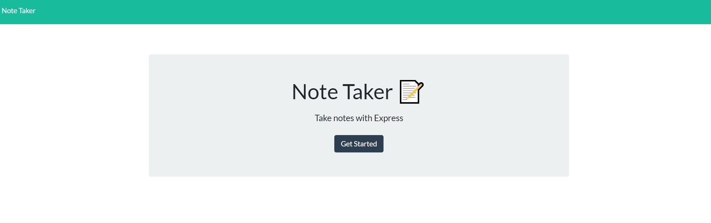
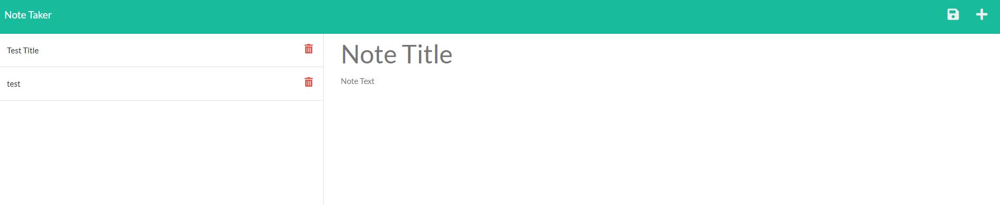
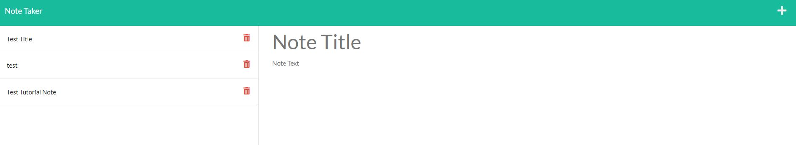

# Braxton M | UCBC11_NoteTaker | README

The objective of the Note Taker app is to use Express.js as a backend to add, save, and delete notes within the browser and store them into a db.json file.
This is a simple note taking application for the user of of small buisness owner. The applicaiton is built using javascript and the express.js package which has been deployed through Heroku.


The application was given front-end starter code


## Acceptance Criteria


```
GIVEN a note-taking application
WHEN I open the Note Taker
THEN I am presented with a landing page with a link to a notes page
WHEN I click on the link to the notes page
THEN I am presented with a page with existing notes listed in the left-hand column, plus empty fields to enter a new note title and the note’s text in the right-hand column
WHEN I enter a new note title and the note’s text
THEN a Save icon appears in the navigation at the top of the page
WHEN I click on the Save icon
THEN the new note I have entered is saved and appears in the left-hand column with the other existing notes
WHEN I click on an existing note in the list in the left-hand column
THEN that note appears in the right-hand column
WHEN I click on the Write icon in the navigation at the top of the page
THEN I am presented with empty fields to enter a new note title and the note’s text in the right-hand column
```

## Screenshots

Screenshots of the Application

* Screenshot 1: Landing Page

* Screenshot 2: Notes Page

* Screenshot 3: Added Test note on the left column


## Assignment Links

- [Heroku Live Page](https://blooming-falls-06149.herokuapp.com/)
- [Github Project Repository](https://github.com/BrackyM/UCBC11_NoteTaker)


##  Contributors / Resouces Used
    
UC Berkley Tutoring 

Ishwardeep Singh Anand - [Github](https://github.com/ianad389)
